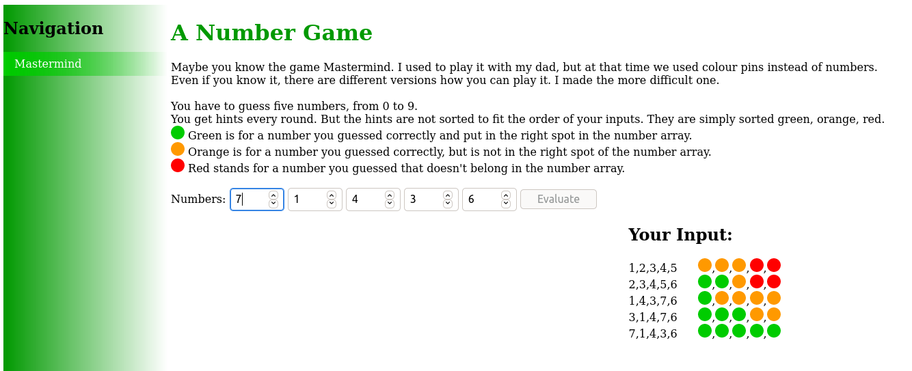

# Mastermind Game
This game was originally a board game from 1970.

The player has to guess a number of five digits. After each guess the player gets hints to determine which digits are correct.
- Green stands for a number you guessed correctly and put in the right spot in the number array.
- Orange stands for a number you guessed correctly, but is not in the right spot of the number array.
- Red stands for a number you guessed that doesn't belong in the number array.

Play it on [my GitHub Pages](https://sarahlucke.github.io/playground/Mastermind/)

---
## Implementation

The game is completely done in JavaScript using HTML input elements.

## License
[GNU General Public License 3](LICENSE)
